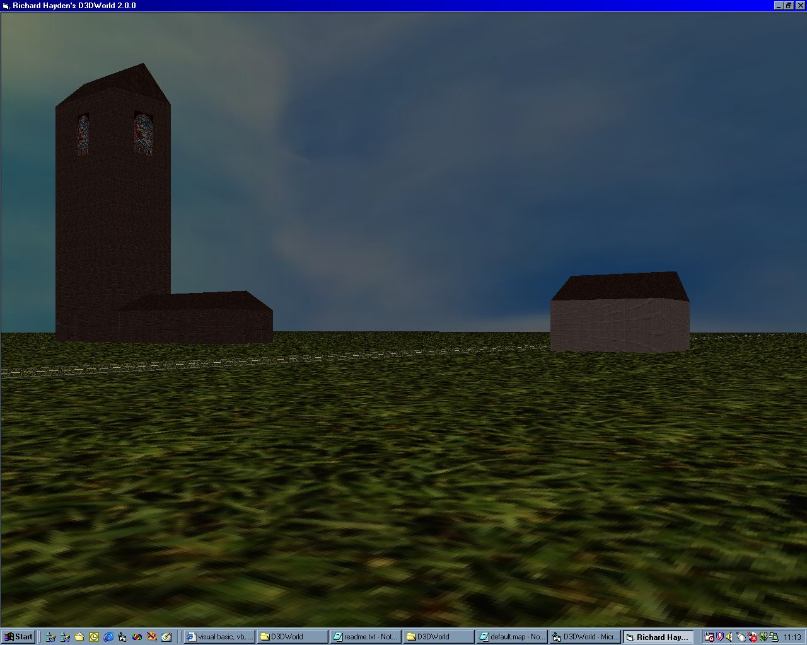



## D3DWorld Version 2\.0 \(Direct3D 8\)

### Description

Version 2.0.0 of Richard Hayden's D3DWorld is a great improvement on version 1 (D3DScene) of my Direct3D 8-based 3D world.

Lighting is now used in many shapes and forms to enhance this scene. I have also improved

the program, making it more efficient and it runs slightly faster.

I have added a church-style building to the world (complete with stained-glass windows),

which looks pretty effective.

Six times of day are now simulated realistically using lighting. The screenshot below

was taken when the time of day was set to evening.

Next I hope to add collision detection and transparency and billboarding, to simulate objects

like trees etc. If anyone can help with the collision detection and transparency areas, then

please do. (r_hayden@breathemail.net). I also hope to make a more realistic sky.

So look out for any proceeding versions!

Please vote and/or provide feedback in return for me making this code available to you!

On my last submission I was quite dissapointed that out of about 400 visits, there were only 4 votes and about 2 feedbacks, apart from my own 2 comments. Really, the least people can do for developers who put up their code here for free, is to rate it!
 
### More Info
 

             |
---                |---
**Submitted On**   |2000-12-17 11:11:02
**By**             |[Rich Hayden](https://github.com/Planet-Source-Code/PSCIndex/blob/master/ByAuthor/rich-hayden.md)
**Level**          |Intermediate
**User Rating**    |4.9 (243 globes from 50 users)
**Compatibility**  |VB 6\.0
**Category**       |[DirectX](https://github.com/Planet-Source-Code/PSCIndex/blob/master/ByCategory/directx__1-44.md)
**World**          |[Visual Basic](https://github.com/Planet-Source-Code/PSCIndex/blob/master/ByWorld/visual-basic.md)
**Archive File**   |[CODE\_UPLOAD1277412172000\.zip](https://github.com/Planet-Source-Code/rich-hayden-d3dworld-version-2-0-direct3d-8__1-13662/archive/master.zip)

### API Declarations

See Code.

